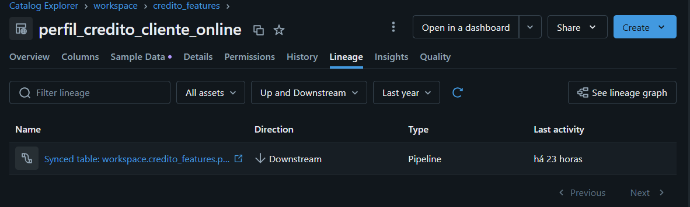
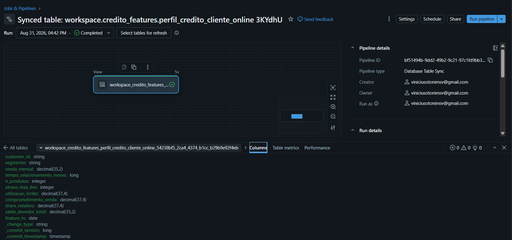
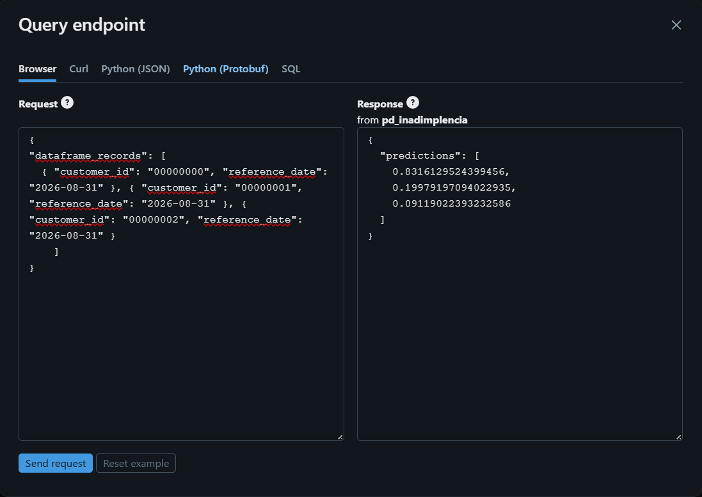

# O ciclo de ML escrito uma vez

**Atenção**: este repositório é o outro lado do comparativo que abri no [`exemplo-domain`](https://github.com/ViniciusOtoni/exemplo-domain). Lá eu mostro o que o cientista de dados vê; aqui eu mostro o que sustenta aquilo. Não vamos nos aprofundar em conceitos de Ciência de Dados como estatística etc. Peguei este recorte por ser o componente que eu de fato mantenho, e porque é nele que a diferença entre "ter processo" e "não ter processo" aparece em código.

Ressalto desde já que os cinco contextos estarem num pacote só é uma decisão de **apresentação**, e não uma recomendação de arquitetura. Em escala, cada componente com o seu próprio repositório é o desenho que eu defenderia, e a seção [Quando isso deveria ser N repositórios](#quando-isso-deveria-ser-n-repositórios) trata disso.

O mesmo ciclo estava escrito **quatro** vezes. O que mudou não foi o número de repositórios, foi passar a existir **um** contrato.

## Problema de reescrever o ciclo em cada componente

| Indicador | Valor | Onde se verifica |
| --- | --- | --- |
| Contextos no pacote | 5 | `src/mlplatform/` |
| Console scripts publicados | 11 | `[project.scripts]` |
| Testes | 280 | `tests/` |
| Suíte completa | 12,6 s | `pytest -q` |
| Infraestrutura para rodar a suíte | nenhuma | sem Spark, sem workspace, sem rede |

Dados do próprio repositório, medidos na versão `3.13.1` do wheel.

Dessa forma, podemos ter a visibilidade de que o ciclo inteiro cabe em um processo local e que o custo de mexer nele é de segundos, não de um cluster subindo. Não vou entrar no mérito das horas perdidas esperando o job falhar no ambiente, mas é fato que isso é um grande alerta para todo time de plataforma, levando em consideração que um dos braços mais relevantes é a velocidade com que ele corrige e devolve o componente para o domínio.

Dito isso, podemos levantar uma série de questionamentos:

* Será que o problema era o número de repositórios? (Acredito que não: o problema era a mesma regra existir em quatro versões, sem nada que dissesse qual delas valia.)

* Como o padrão se mantém quando cinco bundles de domínio dependem da mesma peça, estando ela em um repositório ou em cinco?

---

Esse problema de engenharia que foi abordado e muitos outros que estão atrelados à jornada de ML podem ser resolvidos com um contrato explícito, testável e versionado. Mas antes de explicar como resolver o problema, vamos entender qual é a situação oposta dessa ideação de framework.

## O problema de não ter um framework consolidado

O time de plataforma até consegue entregar o primeiro caso de uso, definir qual será o padrão de escrita da feature table, como o split será feito e onde o modelo será registrado. Porém, ele já começa a se deparar com alguns problemas:

* Onde mora a regra do split temporal? Ela foi copiada para cada repositório e agora existem versões diferentes da mesma regra.

* Como testo o ciclo sem subir um cluster e sem depender de um workspace?

* Como garanto que o pacote embarcado no artefato MLflow não vai puxar `pyspark` dentro do container do endpoint?

* Como o job sabe qual módulo do domínio precisa importar, se não existe mais notebook onde escrever esse import?

Logo, tangibilizando esses questionamentos, podemos enxergar alguns problemas comuns em todo esse processo:

1. A lógica não é isolada da infraestrutura! Logo, para testar uma regra de negócio de três linhas é preciso **Spark**, credencial e rede, e o teste simplesmente deixa de ser escrito.

Também é comum a mesma regra existir em repositórios diferentes com pequenas variações. Isso pode causar um mismatch entre o que roda no treino e o que roda na inferência e dificilmente será notado.

Ressalto que essa duplicação não atrapalha apenas a manutenção do time de plataforma, além de ser mais custosa para a instituição: ela corrói justamente a confiança que a Feature Store tentou construir.

2. Falta de clareza no ponto de entrada. Cada componente descobre o domínio de um jeito, com caminho de arquivo escrito à mão dentro do notebook. Idem para a promoção do pacote: não existe um padrão de release, então cada bundle pina uma coisa diferente e migrar um componente arrasta todos os outros.

Note que todos esses problemas são causados pela falta de fronteiras explícitas dentro do próprio framework. Sem isso, quem escreve a próxima feature fica cego e faz da forma que acha ideal. Pensando em ações tomadas de forma individual e em escala, isso definitivamente é um grande problema e difícil de ser resolvido.

## Como o framework resolve esses problemas

O objetivo é simples: o domínio declara o que é específico dele e o framework monta o job, executa o ciclo e gera o bundle. Porém não é trivial.

A ideia é que o cientista escreva apenas o contrato — a função marcada, a dataclass de treino, a estrutura da tabela de saída e o alvo do monitor — e que tudo o que vem depois (a orquestração, o YAML do job, os grants no Unity Catalog, o registro no MLflow) seja responsabilidade do framework, versionado e testado, e não reescrito componente a componente.

O ganho aqui é deixar a fronteira visível: o que muda por domínio fica no domínio, o que é padrão fica no framework e o que é infraestrutura fica confinado nos adapters. Isso aplica consistência em toda a jornada e, por fim, também economiza custos para a instituição, já que a mesma correção deixa de ser refeita em cada componente.

## Como esse framework foi montado


Cada bloco desse desenho é um contexto do pacote, e nenhum deles é escrito pelo domínio.

```
src/mlplatform/
├── core/          registry, auditoria, naming, geração de bundle, grants no UC
├── features/      janela, gate de qualidade, escrita Delta, sync com o Lakebase
├── training/      split temporal, hiperparâmetros, seleção, registro no UC
├── serving/       score_batch e Model Serving, estrutura da tabela de saída
├── monitoring/    drift via Lakehouse Monitoring, baseline, gatilho de retreino
├── entrypoints.py os console scripts (composition root)
└── testing.py     fakes publicados, para os domínios testarem
```

Aqui eu quebrei o framework em contextos. O repositório de domínio, como o [`exemplo-domain`](https://github.com/ViniciusOtoni/exemplo-domain), apenas declara o que é dele e instala o pacote pinado por release:

```toml
dependencies = [
  "mlplatform @ https://github.com/ViniciusOtoni/platform-libs/releases/download/mlplatform-v3.13.1/mlplatform-3.13.1-py3-none-any.whl",
]
```

### Explicação sobre os componentes

**1. A forma de cada contexto:** os cinco contextos têm o mesmo esqueleto. Quem entende um, entende os outros.

| arquivo | responsabilidade |
| --- | --- |
| `contract.py` | o que o domínio declara, como dataclass ou decorator |
| `ports.py` | os `Protocol` que a lógica consome |
| `usecases.py` | a lógica, sem nenhum import de infraestrutura |
| `adapters.py` | as implementações reais, contra Spark, MLflow e o SDK |
| `resource_gen.py` | o YAML do job que vai para o bundle |
| `naming.py` | nomes derivados (tabela, experimento, endpoint, job) |

O use case recebe as portas por parâmetro. Nada é construído lá dentro:

```python
def run_feature_table(
    spec: FeatureTableSpec,
    reader: SourceReader,
    writer: FeatureWriter,
    audit: AuditStore,
    clock: Clock,
    ...
) -> None:
```

Quem constrói é o `entrypoints.py`, e só ele. É onde a árvore de dependências é montada uma vez por processo, e é o único lugar do framework que conhece ao mesmo tempo a lógica e a infraestrutura.

O ganho prático é o tempo de teste. A suíte inteira roda em um processo local, sem Spark, sem workspace, sem rede.

**2. O contrato de import:** duas regras, e as duas valem mais do que parecem.

Contextos não se importam entre si. `features` não importa `training`, e assim por diante. O que for comum sobe para `core`.

Note que essa é uma garantia que repositórios separados davam de graça: lá o acoplamento entre contextos era impossível por construção. Num pacote só ele custa um import, e voltaria em semanas se dependesse de code review, então precisa ser comprado de volta com lint e teste. É a primeira fatura de juntar tudo, e ela é paga em ferramenta.

Infraestrutura só entra pelos adapters, e com o import dentro do método. Não no topo do arquivo.

A segunda regra existe por um motivo que não é estilo. O `register_model` chama `fe.log_model(..., code_paths=[...])`, o que empacota o fonte do framework dentro do artefato MLflow. O MLflow então importa esse pacote dentro do container do endpoint de serving, onde pyspark, delta e o `databricks-sdk` não estão instalados.

Se `import mlplatform` puxar infraestrutura transitivamente, o endpoint quebra em produção, e nenhum teste comum pega, porque nenhum teste roda dentro daquele container.

As duas regras são verificadas de dois lados. O lint recusa o import:

```toml
[lint.flake8-tidy-imports.banned-api]
"mlplatform.features".msg = "bounded contexts não se importam entre si, compartilhe via mlplatform.core"
"pyspark".msg = "infraestrutura só em adapters.py, e com o import dentro do método"
```

E um teste mede o que de fato foi carregado, num subprocesso limpo:

```python
INFRA_ROOTS = ("pyspark", "delta", "databricks", "mlflow", "sklearn")

_PROBE = """
import sys
import {module}
found = sorted({{m.split('.')[0] for m in sys.modules}} & {roots})
print(','.join(found))
"""
```

Note que o lint pega a intenção e o teste pega o efeito. Um import indireto, três níveis abaixo, escapa do primeiro e não escapa do segundo.

**3. Descoberta do domínio:** o framework não tem caminho de arquivo hardcoded para o domínio. O repositório se declara no próprio `pyproject.toml`:

```toml
[project.entry-points."mlplatform.domains"]
credito_features = "credito_features.configs"
```

Importar esse módulo dispara os decorators e as chamadas de registro. Antes isso era um `import` escrito à mão dentro de cada notebook; com `python_wheel_task` não existe notebook onde escrevê-lo.

Isso foi verificado ao vivo em serverless: entry points de um wheel entregue via `environments[].spec.dependencies` são visíveis a `importlib.metadata`, e o `load()` dispara o efeito colateral de import.

**4. Os quatro contratos:** é tudo o que o cientista escreve.

A **feature table** é uma função marcada. O nome da função vira o nome da tabela.

```python
@feature_table(
    domain="credito",
    entity_keys=["customer_id"],
    timestamp_key="feature_ts",
    sources=["raw.credito_posicoes"],
    online=True,
)
def perfil_credito_cliente(sources, window):
    ...
```

O `online=True` é uma linha do contrato, e é o adapter que transforma isso em pipeline de sync.

**Linhagem entre a Feature Table e a Synced Table**



**Synced Table (Tabela no Lakebase)**



O **treino** é uma dataclass. O algoritmo entra como classe, não como string, e os hiperparâmetros como lista de dicionários: cada combinação vira um run aninhado no MLflow.

```python
@dataclass
class TrainingConfig:
    domain: str
    model_name: str
    algorithm: type
    hyperparameter_sets: list[dict]
    feature_lookups: list[FeatureLookupSpec]
    spine_table: str
    label_column: str
    reference_date_column: str
    train_pct: float
    val_pct: float
    test_pct: float
    metric: str | Callable
    metric_direction: Literal["maximize", "minimize"]
    promotion_alias: str | None = "champion"
```

Cada dicionário da lista vira um `child run`, e a comparação pela `metric` declarada é que promove o **champion**. Note na coluna `promoted_alias` que quem move o alias é o framework, não o cientista.


O `promotion_alias` aceita `None`. É o que permite que o retreino disparado por drift registre um candidato sem mover o alias do champion.

Os `feature_lookups` também são gravados dentro do artefato, e é daí que sai a linhagem entre a feature table e a versão do modelo:


O **serving batch** carrega a estrutura da tabela de saída, e essa parte é contrato, não construtor de dataframe:

```python
@dataclass(frozen=True)
class InferenceBatchStruct:
    primary_key: list[str]
    ts_date: str
    predict_cols: list[str]
    feature_cols: list[str] = field(default_factory=list)
    label_col: str | None = None
```

Do lado online, o mesmo artefato responde sem receber feature nenhuma no request, porque o `FeatureLookup` viajou junto com o modelo. É este container que a regra de import do adapter protege:



A separação entre `ts_date` (a safra de referência) e `scored_at` (o instante da execução, que o framework grava sozinho) é o que permite reprocessar uma safra antiga sem que ela se confunda com a corrente. As `feature_cols` ficam gravadas porque são a base do data drift: sem elas, comparar safras exigiria refazer o join do `FeatureLookup` a posteriori, contra feature tables que já mudaram.

O **monitoramento** declara o alvo, as colunas e o limiar:

```python
@dataclass
class MonitoringConfig:
    domain: str
    model_name: str
    target_type: Literal["feature_table", "predictions"]
    target_table: str
    columns: list[str]
    threshold: float
    schedule_cron: str
    drift_metric: str = DEFAULT_DRIFT_METRIC
```

Do limiar e do cron declarados aqui saem o monitor, o baseline e o dashboard, sem o domínio escrever uma linha de SQL:


**5. Console scripts:** onze, todos apontando para `entrypoints.py`.

| script | o que faz |
| --- | --- |
| `mlp-run-feature-table` | executa uma feature table, em modo incremental ou backfill |
| `mlp-prepare-training-set` | monta o conjunto de treino com `FeatureLookup` |
| `mlp-fit-compare` | treina cada combinação de hiperparâmetros num run aninhado |
| `mlp-select-test-register` | escolhe o vencedor, testa uma vez e registra no UC |
| `mlp-score-batch` | pontua a carteira e grava a tabela de predições |
| `mlp-refresh-endpoint` | cria ou atualiza o endpoint de Model Serving |
| `mlp-evaluate-drift` | roda o monitor, lê a métrica e decide o veredito |
| `mlp-model-version` | resolve a versão por trás de um alias |
| `mlp-promote-model` | move o alias para a versão aprovada |
| `mlp-generate-resources` | gera o YAML dos jobs |
| `mlp-generate-bundle` | materializa o bundle DAB inteiro |

É assim que o job de um domínio aparece do outro lado: uma task só, apontando para o wheel `mlplatform`, sem notebook e sem a task de tabela master.


### Como o pacote chega no domínio

A CI roda no PR contra a `main`, consumindo a esteira compartilhada do [`mlops-platform`](https://github.com/ViniciusOtoni/mlops-platform):

```yaml
jobs:
  ci:
    uses: ViniciusOtoni/mlops-platform/.github/workflows/ci-validate.yml@main
    with:
      working-directory: .
      ruff-config: ruff-framework.toml
    secrets: inherit
```

O `ruff-framework.toml` é o contrato de arquitetura interna descrito acima. Repositórios de domínio como o [`exemplo-domain`](https://github.com/ViniciusOtoni/exemplo-domain) ficam no `ruff.toml` puro, porque eles importam pyspark e o SDK legitimamente e as regras de import misfirariam lá.

O merge na `main` cria a tag, publica a release e anexa o wheel. Cada bundle de domínio pina a URL exata dessa release, o que permite subir um componente sem arrastar os outros.

Note que a versão é pinada exata, nunca por range. Enquanto um pacote único serve cinco bundles, é isso que preserva a possibilidade de migrar um de cada vez. Repare no efeito colateral: uma correção que só toca `monitoring` gera uma versão nova do pacote inteiro, e os cinco bundles passam a estar atrás de uma release que, para quatro deles, não mudou nada.

### Quando isso deveria ser N repositórios

Aqui os cinco contextos moram juntos por um motivo específico: a jornada precisava caber em um lugar só para ser apresentada de ponta a ponta. Não é o desenho que eu levaria para escala, e vale dizer por quê.

Cada contexto já é fechado. Ele tem o seu `contract.py`, as suas `ports.py`, os seus `usecases.py`, os seus `adapters.py`, o seu `resource_gen.py` e o seu `naming.py`, e não importa nenhum outro contexto. A fronteira que separaria os repositórios já existe; o que ela ainda não tem é uma fronteira de **entrega**.

O que cada componente ganharia ao virar repositório próprio:

| o que passa a ser dele | por que importa em escala |
| --- | --- |
| esteira de CI/CD própria | o lint e a suíte rodam sobre o que mudou, não sobre os cinco contextos |
| cadência de release própria | corrigir o monitor não obriga treino e serving a atravessar uma versão nova |
| template de bundle próprio | o job de features evolui sem tocar no YAML dos outros componentes |
| versionamento próprio | o domínio pina `features@2.4.0` e `serving@1.9.0`, e migra um por vez |
| dono explícito | o `CODEOWNERS` deixa de ser do pacote inteiro e passa a ser do componente |

E o que fica mais caro, que é a parte que raramente aparece nas apresentações:

* O que hoje é `core` vira um pacote publicado, e todo contexto passa a depender de uma versão dele. Mudança em `core` vira migração coordenada entre N repositórios, e não mais um import.

* Aparece uma matriz de compatibilidade. Alguém precisa responder se `training@3.2` funciona com `core@1.7`, e essa resposta tem que ser testada em algum lugar.

* A esteira compartilhada passa a ser obrigatória, não conveniente. Sem algo como o [`mlops-platform`](https://github.com/ViniciusOtoni/mlops-platform), cada repositório reinventa a sua CI e o padrão se dissolve exatamente onde ele deveria ser mais forte.

O corte, então, não é ideológico. Ele é o ponto em que os componentes passam a evoluir em ritmos diferentes e a ter donos diferentes: enquanto o mesmo time mexe nos cinco na mesma semana, o pacote único paga menos; quando cada componente tem o seu backlog e a sua janela de deploy, o repositório separado paga menos. O que não muda em nenhum dos dois cenários é o contrato, e é por isso que ele é a parte que este repositório trata como intocável.

### Como rodar aqui

```bash
python -m venv .venv
.venv/Scripts/python -m pip install -e ".[dev]"
.venv/Scripts/python -m pytest
```

```bash
ruff check --config ../mlops-platform/ruff-framework.toml .
```

Os specs de design de cada contexto estão em `docs/<contexto>/superpowers/specs/`.

### Qual foi o caminho da minha solução

Hoje meu framework está totalmente atrelado ao Databricks. Talvez com um certo viés pelo fato de a empresa em que eu trabalho utilizar a ferramenta, mas é fato que, com ela, conseguimos amarrar o ciclo inteiro em um artefato só: o wheel entra no bundle, o bundle vira job, o job resolve o entry point e o mesmo pacote ainda viaja dentro do modelo até o endpoint.

Conseguimos manter a lógica pura e testável e ainda confinar a infraestrutura real nos adapters; também conseguimos utilizar os `entry points` para descobrir o domínio sem caminho hardcoded, além de conseguir promover o reúso do nosso componente em toda a plataforma.

Ressalto que essa é a solução para o recorte que eu quis mostrar, com um domínio de exemplo em [`exemplo-domain`](https://github.com/ViniciusOtoni/exemplo-domain) e um time só mantendo os cinco contextos. Troque qualquer uma dessas duas condições e o desenho de entrega muda, ainda que o contrato não mude.

## Como outros players reagiram ao mesmo problema

Os problemas que levantei acima não estão presentes apenas no meu ecossistema. A Uber e a Netflix passaram exatamente pela mesma dor e publicaram o que fizeram, e o interessante é que responderam de formas opostas.

### Uber (Michelangelo e o Palette)

O problema que a Uber identificou foi exatamente o ponto que já mencionei. Cada time criava o seu pipeline e o modelo de produção não refletia o modelo que foi treinado pelo cientista no ambiente de experimentação.

Eles centralizaram a resposta na **plataforma**: as features são referenciadas por **nome canônico** dentro da configuração do modelo, e é a plataforma que resolve sozinha se aquilo vira um join para geração da master ou um lookup de baixa latência. O cientista não escolhe o caminho, ele declara o nome, que é exatamente o espírito do contrato descrito aqui.

### Netflix (Metaflow)

O Metaflow é uma biblioteca Python: o fluxo é uma classe com `@step`, análogo aos nodes do Kedro, DAGs do Airflow etc. O cientista não decide o que persistir. Ele foca apenas em aplicar a regra de negócio para gerar o seu modelo de ML. A infraestrutura é uma dependência via `@conda`/`@pypi`, a escala vem via `@batch`/`@kubernetes`, e a produção fica com um scheduler externo.

A mensagem aqui é a decisão tomada por ambas as empresas. No caso da Netflix, a responsabilidade está mais atrelada ao cientista, dando maior flexibilidade. Já a Uber foi para o caminho de uma plataforma que, de forma implícita, coordena o fluxo de vida do ecossistema de ML da instituição. Este pacote fica no meio: a forma de declarar é de biblioteca, com decorator e dataclass, mas quem executa o ciclo e quem gera o job é a plataforma.

**Fontes:** [Meet Michelangelo (Uber)](https://www.uber.com/blog/michelangelo-machine-learning-platform/), [Michelangelo Palette (InfoQ)](https://www.infoq.com/presentations/michelangelo-palette-uber/), [Open-Sourcing Metaflow (Netflix)](https://netflixtechblog.com/open-sourcing-metaflow-a-human-centric-framework-for-data-science-fa72e04a5d9).

## O que muda no fim

Fazendo uma alusão aos questionamentos levantados no começo: o problema era mesmo o número de repositórios? Não posso dizer que essa é a única leitura possível, mas tudo indica que era o mesmo ciclo escrito quatro vezes sem contrato, e o que mudou foi passar a existir um. Onde esse contrato mora, se em um repositório ou em cinco, é a decisão seguinte, e ela depende de escala.

### As perguntas do começo, respondidas

No início, levantei alguns questionamentos do time de plataforma. Todos já foram respondidos de forma mais detalhada em suas respectivas sessões [Explicação sobre os componentes](#explicação-sobre-os-componentes):

| A pergunta do começo | O que responde | A prova |
| --- | --- | --- |
| *Onde mora a regra, se ela foi copiada para todo lado?* | um contrato por contexto, todos com o mesmo esqueleto | [arquitetura](docs/img/arquitetura.png) · [linhagem da feature](docs/img/lineage-feature.png) |
| *Como testo o ciclo sem cluster?* | portas recebidas por parâmetro e fakes publicados | `mlplatform.testing` · 280 testes em 12,6 s |
| *Como garanto que o endpoint não puxa infra?* | import de infraestrutura só dentro do adapter | [score online](docs/img/score-online.png) · `test_import_hygiene` |
| *Como o job descobre o domínio sem notebook?* | entry point declarado no `pyproject.toml` do domínio | [task do wheel](docs/img/score-batch.png) · [child runs e champion](docs/img/runs-mlflow.png) |

Note que aqui reduzimos a duplicação da lógica, aumentamos a eficiência do ciclo de correção e temos uma maior confiança e maturidade nos processos. O trade-off é o que descrevi em [Quando isso deveria ser N repositórios](#quando-isso-deveria-ser-n-repositórios): manter os cinco contextos juntos foi uma escolha de apresentação, e ela cobra em release acoplada e em ponto único de mudança. Em escala, esse mesmo contrato caberia em cinco repositórios, cada um com a sua esteira e a sua cadência, mas isso é uma discussão para outro dia hahaha

### O ganho por persona

**Para o cientista:** ele escreve contrato, e não orquestração. Isso vale igual esteja o framework em um repositório ou em cinco, porque o que ele importa é o contrato.

**Para o time de plataforma:** a arquitetura verificada por lint e por teste, e uma fronteira por contexto que já está pronta para virar um repositório quando o componente pedir dono e cadência próprios.

**Para a instituição:** eficiência e controle. O componente novo já nasce padronizado; o ciclo de correção deixa de depender de cluster e passa a durar segundos.

Um framework não deixa o modelo mais inteligente. Ele faz com que o ciclo escrito uma vez seja exatamente o ciclo que roda em todos os domínios, esteja ele empacotado junto ou separado.
