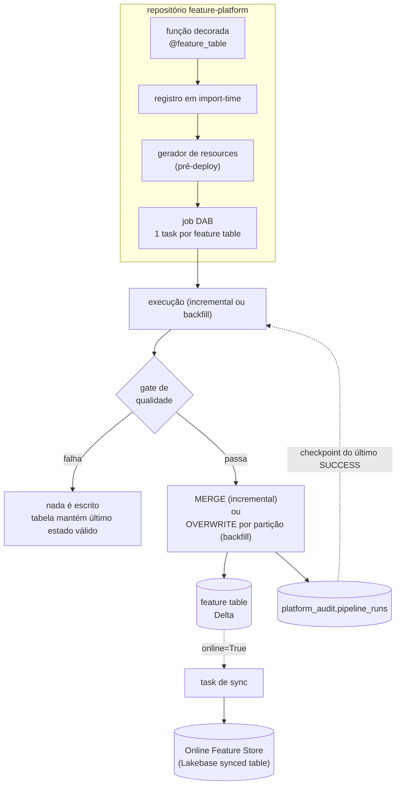

# Design: Componente de Geração de Features

## 1. Contexto

A POC [`databricks-feature-lookup-poc`](https://github.com/ViniciusOtoni/databricks-feature-lookup-poc)
comprovou que o Feature Engineering in Unity Catalog (FE) elimina a duplicação da
lógica de recuperação entre treino e inferência sem alterar o resultado do modelo (diff
máximo `0.0` entre join manual e `FeatureLookup`) e sem exigir infraestrutura além da
que a plataforma já oferece.

A decisão validada abre a porta para um ecossistema de ML de plataforma no Databricks,
com quatro componentes: geração de features, treino, serving e monitoramento,
orquestrados por GitHub Actions e Databricks Asset Bundles (DABs) na Databricks Free
Edition. Os quatro componentes são subsistemas com ciclos de vida próprios demais para
um único design — este documento cobre só o primeiro: **geração de features**, ponto de
partida porque os outros três dependem de feature tables maduras.

O design a seguir foi produzido em interview round-a-round com o usuário (método da
skill `grilling`), com cada decisão explicitamente aprovada antes de avançar para a
próxima. Uma pesquisa dedicada confirmou um fato que corrige a premissa original do
usuário: **"Online Tables" é uma API legada, com criação bloqueada e acesso removido
desde 15/01/2026** ([Free Edition limitations](https://docs.databricks.com/aws/en/getting-started/free-edition-limitations),
[Migrate from legacy online tables](https://learn.microsoft.com/en-us/azure/databricks/machine-learning/feature-store/migrate-from-online-tables)).
O substituto oficial — o **Online Feature Store**, apoiado no **Lakebase** (Postgres
provisionado/autoscaling) via *synced tables* — está refletido neste design.

## 1.1 Emenda (2026-08-23, durante o design da arquitetura de plataforma)

Depois deste spec aprovado, uma decisão de arquitetura cross-cutting (documentada em
[`mlops-platform`](https://github.com/ViniciusOtoni/mlops-platform)) reverteu a
premissa da seção 6: este repositório deixa de hospedar pastas de domínio de negócio
reais. Ele passa a ser um **framework puro** — só a lib, os testes e uma pasta
`examples/` não-produtiva, usada como harness de integração do próprio framework (não
mais `dominios/<domínio>/`).

Domínios de negócio reais (ex.: crédito, cobrança) passam a viver em **repositórios
próprios**, um por domínio, que instalam este pacote via
`pip install git+https://github.com/ViniciusOtoni/feature-platform@vX.Y.Z` (tag
semver, versionamento manual) e declaram lá suas feature tables. A seção 6 abaixo é
atualizada para refletir isso; o restante do spec (contrato, execução, gate de
qualidade, versionamento, auditoria) não muda em nada — a mudança é só sobre onde o
código de domínio mora, não sobre como o framework funciona.

O `.github/workflows/deploy.yml` deste repositório passa a ser um caller fino do
reusable workflow centralizado em `mlops-platform` (`deploy-bundle.yml`), em vez de um
workflow inline duplicado entre os quatro componentes.

## 2. Escopo

**Dentro do escopo:**
- Contrato de definição de feature table (decorator Python).
- Execução em dois modos: incremental (batch) e backfill (reprocessamento).
- Geração automática do job de orquestração (Databricks Workflows via DABs).
- Gate de qualidade obrigatório antes de a feature table ficar consumível.
- Versionamento de features por mudança de lógica de negócio.
- Sincronização opcional para Online Feature Store (Lakebase).
- Tabela de auditoria central, desenhada aqui para ser reusada pelos componentes de
  treino, serving e monitoramento.

**Fora do escopo (decisão explícita, não omissão):**
- **Feature Functions** (features calculadas sob demanda no momento do lookup). Sem
  caso de uso concreto até o momento; a Feature Engineering API do Databricks já
  suporta nativamente, então adiar não fecha essa porta.
- **Transformações específicas de modelo** (ex.: engenharia de feature atrelada à regra
  de negócio de um modelo específico, implementada via `TransformerMixin` /
  `BaseEstimator`). Isso pertence ao componente de Treino: feature tables armazenam
  apenas features genéricas e reutilizáveis entre modelos.
- Lógica de cálculo de feature em si (o "o quê" da transformação) — como na POC, este
  componente registra, versiona, orquestra e serve; ele não decide o que uma feature
  significa.

## 3. Arquitetura geral



## 4. Contrato de definição

A única forma de declarar uma feature table é decorando a função Python que a computa:

```python
@feature_table(
    domain="credito",
    entity_keys=["customer_id"],
    timestamp_key="feature_ts",
    sources=["raw.transactions"],
    online=False,
    depends_on=[],
    table_name=None,
)
def customer_transaction_features(sources: dict[str, DataFrame], window: DateRange) -> DataFrame:
    raw = sources["raw.transactions"]
    return (
        raw.filter((F.col("event_ts") >= window.start) & (F.col("event_ts") < window.end))
        .groupBy("customer_id")
        .agg(F.count("*").alias("txn_count_30d"), F.avg("amount").alias("avg_ticket"))
        .withColumn("feature_ts", F.lit(window.end))
    )
```

| Parâmetro | Obrigatório | Descrição |
|---|---|---|
| `domain` | sim (emenda 1.1) | Nome do domínio de negócio, declarado explicitamente — antes (pré-emenda) era inferido do caminho `dominios/<domínio>/` dentro deste repositório; sem essa pasta, não há mais caminho para inferir de forma confiável, já que cada domínio agora é o próprio repositório. |
| `entity_keys` | sim | Chave(s) primária(s) da feature table. |
| `timestamp_key` | sim | Coluna que marca desde quando o valor passou a ser verdade. Exatamente uma, por restrição do Databricks para time series feature tables. |
| `sources` | sim | Lista de tabelas de origem. O framework resolve cada nome para um `DataFrame` e injeta em `sources` no `compute()` — é isso que dá lineage real (qual tabela bruta alimenta qual feature table). |
| `online` | não (default `False`) | Se `True`, habilita a sincronização automática para o Online Feature Store após cada escrita bem-sucedida. |
| `depends_on` | não (default `[]`) | Lista de outras feature tables (decoradas neste mesmo repositório) das quais esta depende. Usado apenas quando uma feature deriva de outra feature, não de uma fonte bruta — caso raro. |
| `table_name` | não (default `None`) | Quando omitido, o nome é derivado como `<catalog>.<domínio>_features.<nome_da_função>`. Quando informado, é validado contra uma regex de convenção antes de ser aceito. |

Responsabilidades do framework:
- Resolver `sources` e injetar os DataFrames correspondentes.
- Calcular e injetar `window` (um intervalo `start`/`end`) de acordo com o modo de
  execução (seção 5) — o framework nunca infere sozinho qual coluna de uma fonte bruta
  representa "data"; é o `compute()` do usuário que aplica o filtro de janela sobre a
  fonte correta.
- Decidir a estratégia de escrita (`MERGE` ou `INSERT OVERWRITE` por partição).
- Rodar o gate de qualidade antes de comitar a escrita.
- Registrar a execução na tabela de auditoria.

Responsabilidade do usuário: apenas a lógica de `compute()` — a transformação em si.

## 5. Execução: incremental e backfill

A mesma função `compute()` serve os dois modos. O que muda é decidido pelo motor, nunca
pelo usuário:

| | Incremental (batch) | Backfill |
|---|---|---|
| Janela (`window`) | do fim do último run `SUCCESS` registrado em `platform_audit.pipeline_runs` até agora | range explícito de datas, informado como parâmetro do job |
| Escrita | `MERGE` | `INSERT OVERWRITE` por partição |
| Disparo | schedule do job (cron declarado no resource DAB) | manual: `databricks bundle run <job> --params mode=backfill start_date=... end_date=...` |
| Uso típico | atualização diária de rotina | correção de uma janela histórica, carga inicial de uma feature table nova |

**Checkpointing e catch-up automático.** O modo incremental nunca usa uma data relativa
fixa (tipo "sempre D-1"). Ele consulta `platform_audit.pipeline_runs`, filtra pela
feature table em questão, pega o fim da janela do último run `SUCCESS` e processa dali
até agora. Se uma execução falhar ou for pulada (ex.: cluster indisponível num dia), a
próxima execução incremental cobre o intervalo perdido automaticamente, sem
intervenção manual — o gap nunca fica silencioso.

**Backfill é sempre manual, nunca automático.** Reprocessar histórico é uma operação
cara e, dependendo do range, destrutiva o suficiente para exigir uma decisão humana. Um
disparo automático por diff de código no PR (ex.: "mudou o `compute()`, dispara
backfill sozinho") foi considerado e descartado: qualquer refatoração cosmética
dispararia reprocessamento caro, e a seção 7 (versionamento) já torna backfill de uma
tabela existente um evento raro — mudança de lógica de negócio cria uma tabela nova, não
reprocessa a antiga com dado novo por baixo do capô.

## 6. Repositório e orquestração

`feature-platform` é um **framework puro** (emenda 1.1): a lib instalável (contém o
decorator, o motor de execução, o gerador de resources e os checks de qualidade
padrão) mais uma única pasta `examples/`, não-produtiva, usada só para testar o
framework de ponta a ponta. Domínios de negócio reais (ex.: crédito, cobrança) vivem em
repositórios próprios, que instalam este pacote via pip (tag semver) e declaram lá
suas feature tables — ver a convenção completa em `mlops-platform`.

**Um job DAB por repositório**, não por feature table. Um script de geração roda antes
do `databricks bundle deploy`, varre o registro de decorators (`@feature_table`)
populado em import-time e emite uma **task por feature table encontrada** no resource
YAML do job. Isso preserva observabilidade por tabela no Workflows UI — uma falha numa
feature table aparece como uma task vermelha isolada, não confundida com as demais —
sem exigir um job inteiro por tabela.

Tasks sem `depends_on` rodam em paralelo por padrão, já que a maioria das feature
tables de um mesmo repositório não depende umas das outras (leem a mesma fonte bruta,
produzem tabelas diferentes). `depends_on` explícito no decorator vira uma aresta
sequencial no grafo de tasks do job, para o caso raro de uma feature table derivar de
outra. O teto de 5 tasks concorrentes por conta na Databricks Free Edition
([Free Edition limitations](https://docs.databricks.com/aws/en/getting-started/free-edition-limitations))
age como limite natural de paralelismo, sem exigir gestão manual do usuário.

## 7. Gate de qualidade

Toda feature table passa por um conjunto mínimo obrigatório de checks antes de ficar
disponível para consumo via `FeatureLookup`:

- Unicidade de `entity_keys` (nenhuma linha duplicada por chave + `timestamp_key`).
- Ausência de nulos em `entity_keys` e `timestamp_key`.
- Schema conforme o declarado (tipos e nomes de coluna esperados).
- Freshness: o valor mais recente de `timestamp_key` está dentro do SLA esperado para o
  modo de execução.

Os checks reaproveitam o padrão já validado na POC (`src/quality.py`): cada check
devolve um `Finding` em vez de levantar exceção, para que uma coluna ruim não esconda os
demais resultados.

**O gate bloqueia a escrita.** Se qualquer check obrigatório falhar, nada é gravado na
feature table — ela mantém o estado da última execução bem-sucedida. Esta não é uma
opção configurável por domínio: é a garantia central deste componente, e deixá-la
opcional recriaria o problema que a própria POC documentou (times pulando a etapa por
pressa, item 1.2 do README da POC).

## 8. Versionamento

Mudança de **lógica de negócio** numa feature (por exemplo, a janela de cálculo passa
de 90 para 60 dias) exige uma **nova feature table**, com nome versionado — nunca um
overwrite in-place da semântica de uma coluna existente. A tabela antiga permanece
congelada; modelos em produção que a consomem via `FeatureLookup` não mudam de
comportamento sozinhos na próxima execução de treino ou de backfill.

Esta regra existe porque sobrescrever a lógica em uma tabela já em uso reproduziria,
um nível acima, exatamente o incidente que motivou a POC inteira: alguém ajusta uma
janela, nenhum job falha, nenhum schema quebra, e o sintoma só aparece meses depois como
drift sem causa aparente. Evolução de *schema* aditiva (nova coluna, mesma semântica das
existentes) não exige nova tabela — é coberta pela evolução de schema nativa do Delta.

## 9. Online Feature Store (Lakebase)

Feature tables declaradas com `online=True` ganham, automaticamente, uma task adicional
ao final de cada execução bem-sucedida: a sincronização de uma *synced table* no
**Lakebase**, o mecanismo que hoje sustenta o Online Feature Store do Databricks
([Databricks Online Feature Stores](https://docs.databricks.com/aws/en/machine-learning/feature-store/online-feature-store),
[Synced tables](https://docs.databricks.com/aws/en/oltp/instances/sync-data/sync-table)).
Isso é o que viabiliza, no Componente 3 (Serving), um Feature Serving endpoint online
consumindo a mesma feature table usada no treino.

A flag é opt-in por tabela, não um comportamento padrão global: manter uma synced table
tem custo de sincronização contínua, e nem toda feature genérica alimenta um modelo em
produção com inferência online.

## 10. Auditoria e rastreamento (peça cross-cutting)

Esta é a única peça deste componente desenhada explicitamente para ser reusada, sem
alteração de esquema, pelos componentes de treino, serving e monitoramento — é o
mecanismo de rastreamento de commit/branch pedido para valer em toda a plataforma.

**`TBLPROPERTIES` na própria tabela Delta**: cada feature table carrega o `git_commit` e
a `git_branch` do deploy que gerou seu schema atual, visível diretamente no Catalog
Explorer — resposta imediata para "que código gerou esta tabela".

**Tabela central `platform_audit.pipeline_runs`**: histórico de execuções de qualquer
componente da plataforma.

| Coluna | Descrição |
|---|---|
| `component` | `feature_generation`, `training`, `serving`, `monitoring` |
| `entity_name` | nome da feature table, do modelo ou do endpoint envolvido |
| `git_commit` | SHA do commit que originou o deploy que produziu esta execução |
| `git_branch` | branch de origem do deploy |
| `run_id` | identificador do Databricks Job Run |
| `mode` | `incremental` / `backfill` (para este componente) |
| `status` | `SUCCESS` / `FAILED` |
| `window_start`, `window_end` | janela de dados processada nesta execução |
| `run_ts` | timestamp de início da execução |

Esta tabela cumpre dois papéis neste componente: histórico auditável de execuções, e
fonte do checkpointing incremental descrito na seção 5.

## 11. Riscos e restrições conhecidas (Databricks Free Edition)

Confirmados via pesquisa dedicada em documentação oficial:

| Restrição | Impacto neste componente |
|---|---|
| Jobs: serverless-only, máximo de 5 tasks concorrentes por conta | Já incorporado ao design de paralelismo (seção 6): o teto age como limite natural, não gerido manualmente. |
| "Online Tables" legado desativado desde 15/01/2026 | Design já usa Online Feature Store via Lakebase (seção 9) em vez da API legada. |
| DABs exigem `serverless: true` em todo cluster; backend Terraform precisa de acesso de saída restrito a um allowlist na Free Edition | A POC já segue `serverless: true`; validar o deploy deste novo repositório contra o allowlist antes de assumir que funciona igual. |
| Change Data Feed | Feature nativa do Delta, sem restrição conhecida na Free Edition — não é um risco, listado aqui por completude. |
| Lakehouse Monitoring | Sem confirmação oficial de suporte na Free Edition. Não afeta este componente diretamente, mas é um risco aberto para o Componente 4 (Monitoramento) — não deve ser assumido como funcional até validado ao vivo. |

## 12. Testes

Seguindo o padrão já validado na POC: a camada de lógica pura (resolução de janela,
checks de qualidade, validação de nomenclatura, decisão de estratégia de escrita) é
testável com `pytest` local, sem Spark. A execução real de `compute()` sobre Spark e a
geração/deploy do job DAB são verificadas em ambiente Databricks (Free Edition), via
`databricks bundle validate` e `databricks bundle run`.

## 13. Dependência para os próximos componentes

- **Treino** (Componente 2) consome feature tables deste componente via
  `FeatureLookup`, e reusa a tabela `platform_audit.pipeline_runs` para registrar
  execuções de treino/validação/teste.
- **Serving** (Componente 3) depende de feature tables com `online=True` já
  sincronizadas no Lakebase para expor um Feature Serving endpoint online.
- **Monitoramento** (Componente 4) monitora tanto os dados das feature tables geradas
  aqui quanto os modelos treinados sobre elas, com o risco de Lakehouse Monitoring na
  Free Edition (seção 11) ainda não validado.
