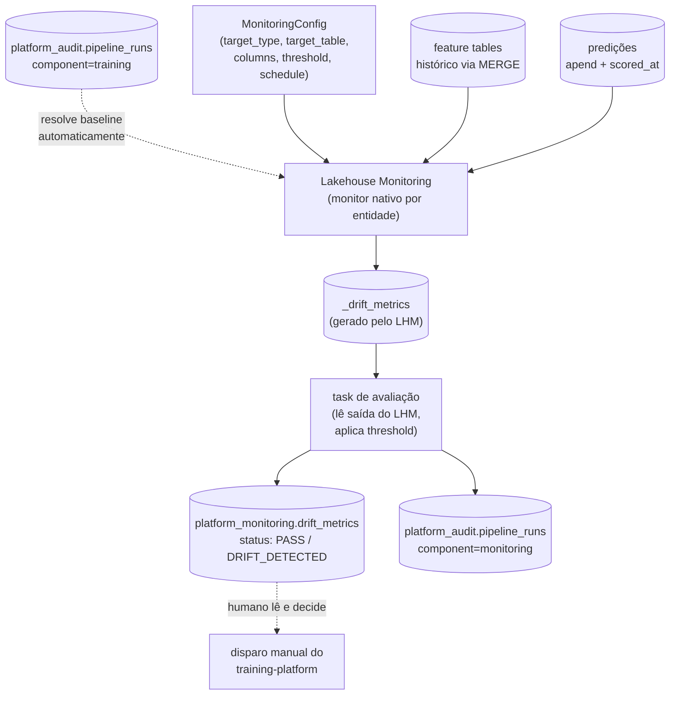

# Design: Componente de Monitoramento

## 1. Contexto

Este é o quarto e último componente do ecossistema de ML no Databricks. Depende de:
- **Componente 1** — [`feature-platform`](https://github.com/ViniciusOtoni/feature-platform):
  feature tables com histórico preservado (`MERGE`, não overwrite).
- **Componente 2** — [`training-platform`](https://github.com/ViniciusOtoni/training-platform):
  modelos registrados, e a tabela `platform_audit.pipeline_runs` guardando o range de
  datas (`window_start`/`window_end`) usado no treino de cada modelo.
- **Componente 3** — [`serving-platform`](https://github.com/ViniciusOtoni/serving-platform):
  tabela de predições em `append` com coluna `scored_at` — emendada durante o design
  deste componente (seção 2 explica por quê).

O pedido original do usuário: monitorar o modelo e os dados das features, para saber
se há model drift ou data drift, e usar isso para sugerir retreino se necessário.

O design foi produzido via interview em rounds (skill `grilling`). Duas pesquisas
dedicadas não confirmaram se o Lakehouse Monitoring funciona na Databricks Free
Edition — o usuário decidiu apostar nele mesmo assim (seção 6), em vez de um fallback
estatístico próprio, aceitando o risco de precisar redesenhar essa parte específica na
implementação.

## 1.1 Emenda (2026-08-23, durante o design da arquitetura de plataforma)

Uma decisão de arquitetura cross-cutting (documentada em
[`mlops-platform`](https://github.com/ViniciusOtoni/mlops-platform)), tomada
imediatamente depois deste spec, reverteu a premissa de que domínios reais vivem
dentro deste repositório. `monitoring-platform` passa a ser um **framework puro** — só
a lib e uma pasta `examples/` não-produtiva (harness de integração), no lugar de
`dominios/<domínio>/`. O contrato `MonitoringConfig` não muda (`domain` já era um
campo explícito da dataclass, nunca inferido).

Domínios reais passam a viver em repositórios próprios, instalando este pacote via
`pip install git+https://github.com/ViniciusOtoni/monitoring-platform@vX.Y.Z` (tag
semver, versionamento manual). O `.github/workflows/deploy.yml` passa a ser um caller
fino do reusable workflow centralizado em `mlops-platform`.

## 2. Achado que motivou emendar o Componente 3

Monitorar drift de predições ("model drift", metade do pedido original) exige
histórico de predições ao longo do tempo. A tabela de predições do Componente 3, como
desenhada originalmente, era sobrescrita a cada execução — só "a foto de agora", sem
histórico algum. Sem isso, não há o que comparar entre janelas de tempo.

Correção aplicada retroativamente no `serving-platform` (spec seção 1.1, plano já
atualizado e commitado): a tabela de predições passou de `overwrite` para `append`,
com uma coluna `scored_at`. Este componente consome essa tabela já no formato correto
— nenhuma lógica de acumulação de histórico de predições precisa existir aqui.

## 3. Escopo

**Dentro do escopo:**
- Contrato único `MonitoringConfig`, cobrindo os dois alvos (feature table e tabela de
  predições) com a mesma mecânica de comparação de distribuição.
- Drift de distribuição via Lakehouse Monitoring nativo, com uma camada de avaliação
  própria que interpreta os resultados contra um threshold e centraliza numa tabela
  única da plataforma.
- Resolução automática da janela de referência (baseline) a partir do histórico já
  registrado em `platform_audit.pipeline_runs`.
- Alerta de "sugestão de retreino" — nunca disparo automático.

**Fora do escopo (decisão explícita):**
- **Performance real do modelo com ground truth** (accuracy/AUC medidos contra label
  real que chega depois). Nenhum componente anterior define como ou quando um label
  real fica disponível para qualquer modelo desta plataforma — construir monitoramento
  de performance em cima dessa incógnita seria desenhar no vácuo. Fica documentado como
  extensão futura, não fechada por este design.
- **Disparo automático de retreino.** Decisão de negócio, mesma fronteira já
  estabelecida na promoção de alias (Componente 2) e na atualização de endpoint
  (Componente 3) — sempre manual.
- **Threshold por coluna.** Um escalar único por `MonitoringConfig` cobre o caso comum;
  sensibilidade diferenciada por coluna fica para quando houver caso de uso concreto.
- **Fallback de drift estatístico próprio** (PSI/KS caseiro). Considerado e descartado
  em favor de apostar no Lakehouse Monitoring nativo — ver seção 6 para o risco
  assumido.

## 4. Arquitetura geral



## 5. Contrato (`MonitoringConfig`)

```python
from dataclasses import dataclass
from typing import Literal


@dataclass
class MonitoringConfig:
    domain: str
    model_name: str
    target_type: Literal["feature_table", "predictions"]
    target_table: str
    columns: list[str]
    threshold: float
    schedule_cron: str
```

Sem campo de baseline explícito. A janela de referência é **resolvida
automaticamente**: o framework consulta `platform_audit.pipeline_runs`, filtra pela
linha `SUCCESS` mais recente com `component="training"` e `entity_name=model_name`, e
usa o `window_start`/`window_end` daquele run como o período de referência. Isso evita
que alguém precise digitar manualmente as mesmas datas que o treino já registrou — e
garante que a baseline nunca diverge silenciosamente do treino real que gerou o modelo
em produção.

`threshold` é um escalar único aplicado a todas as colunas em `columns` — não há
granularidade por coluna no v1.

Instâncias são declaradas em repositórios de domínio próprios (emenda 1.1) — este
repositório só fornece a lib. Um `monitoring_configs.py` de exemplo, não-produtivo,
vive em `examples/`, registrado via `register_monitoring_config(config)`.

## 6. Mecânica: Lakehouse Monitoring nativo (risco aceito)

**Risco explicitamente aceito, não silenciosamente assumido.** Duas pesquisas
dedicadas não confirmaram se o Lakehouse Monitoring está disponível na Databricks Free
Edition — nem a documentação oficial de limitações, nem buscas por relatos da
comunidade trouxeram uma resposta definitiva. A alternativa (um fallback de drift
estatístico próprio, via PySpark/pandas, sem depender de nenhum serviço gerenciado) foi
considerada e descartada deliberadamente: o usuário optou por apostar no Lakehouse
Monitoring nativo e descobrir se funciona durante a implementação, aceitando o risco de
precisar redesenhar esta seção especificamente se não funcionar. O restante do
componente (contrato, tabela central, filosofia de sugestão) não muda mesmo que essa
aposta não se confirme — só o motor de cálculo por baixo do `MonitoringConfig` seria
trocado.

Para cada `MonitoringConfig` registrado, um monitor do Lakehouse Monitoring é criado
sobre `target_table`, perfilando as colunas em `columns`. O LHM atualiza seus próprios
resultados (`<target_table>_profile_metrics`, `<target_table>_drift_metrics`) no
schedule que o próprio monitor define.

**Camada de avaliação própria**, rodando depois de cada refresh do LHM: lê as tabelas
de saída geradas pelo LHM, compara a métrica de drift relevante contra o `threshold` do
`MonitoringConfig`, e escreve uma linha resumida em `platform_monitoring.drift_metrics`
— o LHM faz o cálculo estatístico, este componente faz a interpretação e a
centralização. A exata superfície do SDK/API do Lakehouse Monitoring (nome dos métodos
de criação de monitor, nome das colunas nas tabelas de saída) precisa ser confirmada
contra a documentação e a versão instalada durante a implementação — não é assumida com
certeza aqui.

## 7. Tabela central de drift

`platform_monitoring.drift_metrics`:

| Coluna | Descrição |
|---|---|
| `domain` | domínio do `MonitoringConfig` |
| `model_name` | modelo associado |
| `entity_name` | `target_table` monitorada |
| `target_type` | `"feature_table"` ou `"predictions"` |
| `column_name` | coluna específica avaliada |
| `drift_metric_name` | métrica de drift usada (a que o LHM calculou para aquele tipo de coluna) |
| `drift_metric_value` | valor calculado |
| `threshold` | threshold configurado |
| `status` | `PASS` ou `DRIFT_DETECTED` |
| `window_start` / `window_end` | janela corrente comparada (não a baseline, que já está fixa por modelo) |
| `run_ts` | timestamp da avaliação |

Uma linha `status=DRIFT_DETECTED` **é** a sugestão de retreino — não existe uma tabela
de recomendação separada. Um humano consulta esta tabela (filtrando por
`status=DRIFT_DETECTED`) e decide, manualmente, disparar uma nova execução do
`training-platform`. Nenhum código deste componente chama o `training-platform`.

## 8. Auditoria de execução

Reaproveita **exatamente** `platform_audit.pipeline_runs`, sem estender — mas atenção
à distinção: esta tabela audita a **execução do job de avaliação** (rodou com sucesso
ou falhou), não o **resultado do drift em si** (isso vive em `drift_metrics`, seção 7).

| Coluna | Uso neste componente |
|---|---|
| `component` | `"monitoring"` |
| `entity_name` | `target_table` avaliada |
| `mode` | `"drift_check"` |
| `status` | `SUCCESS`/`FAILED` da execução (não do resultado do drift) |
| `window_start`/`window_end` | janela corrente avaliada nesta execução |

## 9. Geração de recursos e schedule

Gerador dinâmico, mesmo padrão dos Componentes 1 e 3: varre os `MonitoringConfig`
registrados e emite uma task por config dentro de um job com o `schedule_cron`
declarado — monitoramento precisa rodar em cadência regular para cumprir sua função,
diferente do treino (sempre sob demanda).

## 10. Testes

Lógica pura (validação do `MonitoringConfig`, resolução da baseline a partir de linhas
simuladas de `pipeline_runs`, avaliação de threshold sobre valores de drift simulados,
construção do `RunRecord`) testável com `pytest` local, sem Spark e sem o Lakehouse
Monitoring real. A criação efetiva de monitores e a leitura das tabelas de saída do LHM
são exercitadas via notebook num workspace Databricks real — é exatamente aí que o
risco da seção 6 é validado.

## 11. Riscos e restrições conhecidas

| Risco | Situação |
|---|---|
| Lakehouse Monitoring disponível na Free Edition | **Confirmado ao vivo (2026-08-24, implementação): FUNCIONA.** `client.quality_monitors.create/get/run_refresh` existem e respondem; um monitor `snapshot` foi criado com sucesso (`MONITOR_STATUS_ACTIVE`), produziu `PASS` e `DRIFT_DETECTED` reais em `platform_monitoring.drift_metrics`. Ver plano de implementação, Task 12, para os 5 ajustes que foram necessários (nenhum muda o contrato). |
| Superfície exata da API/SDK do Lakehouse Monitoring | **Confirmada ao vivo.** Nomes de método batiam com o assumido; `create()` exige um de `snapshot`/`time_series`/`inference_log` (não documentado nesta seção originalmente); o refresh é assíncrono (5-31min observados) e precisa de polling; os nomes das tabelas de saída vêm de `MonitorInfo.drift_metrics_table_name`, não devem ser montados por concatenação de string. |
| Baseline real (janela de treino) não conectada à criação do monitor | **Novo, achado na implementação.** `resolve_baseline_window` (seção 5) é calculada mas não é usada para materializar uma baseline de verdade no monitor — o monitor `snapshot` compara cada refresh contra o anterior, não contra a janela de treino. Corrigir isso exige uma decisão de design (provavelmente adicionar uma coluna de timestamp ao `MonitoringConfig`) — não fechada nesta sessão. Ver plano, Task 9. |
| Performance real do modelo (ground truth) | Fora de escopo do v1, sem mecanismo de label definido em nenhum componente da plataforma. |

## 12. Fechamento do ecossistema

Com este componente, os quatro specs e planos do ecossistema estão escritos:
geração de features, treino, serving e monitoramento — cada um em seu próprio
repositório, cada um reaproveitando a mesma tabela de auditoria central sem estendê-la
além do necessário, e cada um com um humano no controle de toda decisão que afeta o
que está em produção (promoção de alias, atualização de endpoint, disparo de retreino).
A implementação de cada componente é o próximo passo, feita separadamente, na mesma
ordem de dependência usada para o design.
