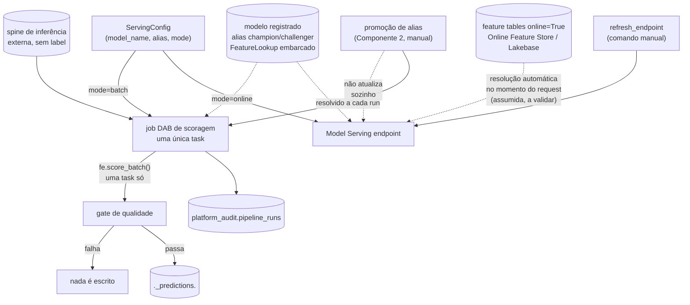

# Design: Componente de Serving

## 1. Contexto

Este é o terceiro dos quatro componentes do ecossistema de ML no Databricks. Depende de:
- **Componente 1** — [`feature-platform`](https://github.com/ViniciusOtoni/feature-platform):
  feature tables com `online=True` já sincronizadas no Online Feature Store (Lakebase).
- **Componente 2** — [`training-platform`](https://github.com/ViniciusOtoni/training-platform):
  modelo registrado em `<catalog>.<domain>_models.<model_name>`, logado via
  `fe.log_model()` (com `FeatureLookup` embarcado), com aliases `champion`/`challenger`
  promovidos manualmente.

O pedido original do usuário: depois de treinar, ele escolhe o processo de inferência
— **online** (deploy de um Serving Endpoint que consome o modelo, com a resolução de
features feita automaticamente pelo Databricks a partir do `FeatureLookup` embarcado)
ou **batch** (deploy de um workflow de scoragem que usa a mesma lib de Feature
Engineering, exatamente como o Cenário B da POC original).

**Ênfase deliberada, pedida explicitamente pelo usuário**: a trilha batch **usa Feature
Engineering para escorar** (`fe.score_batch`), não um join manual. Isso significa que o
job de inferência batch tem **uma única task** responsável pela scoragem — a mesma
vitória que a POC (`databricks-feature-lookup-poc`) já mediu e documentou: sem join
point-in-time escrito à mão, sem tabela intermediária, sem uma segunda task
(`build_master`) antes da task de score. Essa é a razão de existir deste componente:
reproduzir, em produção, o Cenário B da POC — nunca o Cenário A.

O design foi produzido via interview em rounds (skill `grilling`). Uma pesquisa
dedicada confirmou um fato que molda a trilha online: mover o alias `champion` no
Unity Catalog **não atualiza sozinho** um endpoint de Model Serving já provisionado —
é preciso uma chamada explícita de atualização.

## 1.1 Emenda (2026-08-23, durante o design do Componente 4)

O design do Componente 4 (Monitoramento) descobriu que monitorar drift de predições
("model drift") exige histórico das predições ao longo do tempo — e a tabela de
predições, como desenhada originalmente nesta seção, era sobrescrita (`overwrite`) a
cada execução, guardando só "a foto de agora". Sem histórico, não há o que comparar.

Correção: a tabela de predições passa de `overwrite` para **`append`**, com uma nova
coluna `scored_at` (timestamp da execução que gerou aquela linha). Isso não muda nada
do que a seção 5 já descreve sobre a trilha batch em si (continua uma única task,
continua `fe.score_batch`, continua sem checkpoint na leitura da spine) — muda só o
modo de escrita da saída. A tabela de predições deixa de ser um snapshot e passa a ser
um histórico apensado, o que é exatamente o que o Componente 4 precisa para calcular
drift de saída ao longo do tempo.

## 1.2 Emenda (2026-08-23, durante o design da arquitetura de plataforma)

Uma decisão de arquitetura cross-cutting (documentada em
[`mlops-platform`](https://github.com/ViniciusOtoni/mlops-platform)) reverteu a
premissa de que domínios reais vivem dentro deste repositório. `serving-platform`
passa a ser um **framework puro** — só a lib e uma pasta `examples/` não-produtiva
(harness de integração), no lugar de `dominios/<domínio>/`. O contrato `ServingConfig`
não muda (`domain` já era um campo explícito da dataclass, nunca inferido).

Domínios reais passam a viver em repositórios próprios, instalando este pacote via
`pip install git+https://github.com/ViniciusOtoni/serving-platform@vX.Y.Z` (tag
semver, versionamento manual). O `.github/workflows/deploy.yml` passa a ser um caller
fino do reusable workflow centralizado em `mlops-platform`.

## 1.3 Emenda (2026-08-24, achada ao vivo na verificação ponta a ponta)

O gate de qualidade da trilha batch (seção 5) foi desenhado só com "sem nulos na
coluna de predição" — mas isso não pega o caso mais importante: uma entidade da spine
de inferência sem correspondência na feature table (`FeatureLookup` sem match) recebe
colunas de feature nulas, e o modelo (dependendo do algoritmo — `RandomForestClassifier`
do scikit-learn, por exemplo, tolera `NaN` nativamente desde a versão 1.4) ainda assim
produz uma predição não-nula, só que sem sentido algum. Verificado ao vivo: uma spine
com um `customer_id` inexistente na feature table gerou `txn_count=NULL,
avg_ticket=NULL, prediction=0.4015943427487544` — o gate original deixaria passar
silenciosamente. Corrigido estendendo o gate para também checar nulos em **todas as
colunas resolvidas pelo join** (chave de entidade, chave de timestamp e features), não
só na coluna de predição. Ver
`docs/superpowers/plans/2026-08-23-serving-implementation.md`, correção na Task 4.

## 2. Escopo

**Dentro do escopo:**
- Contrato único `ServingConfig`, cobrindo as duas trilhas (online e batch) para o
  mesmo modelo.
- Trilha batch: uma única task de scoragem via `fe.score_batch`, com schedule próprio,
  gate de qualidade bloqueante, saída em tabela de predições com nome convencionado.
- Trilha online: deploy de Model Serving endpoint apontando para um alias configurável,
  mais um mecanismo manual de atualização do endpoint quando o alias muda.
- Geração dinâmica dos recursos DAB (endpoint ou job, dependendo do `mode` de cada
  `ServingConfig` registrado).
- Reuso do schema de auditoria dos Componentes 1 e 2, sem extensão.

**Fora do escopo (decisão explícita):**
- **Geração da spine de inferência.** Mantida pelo time de domínio, mesma fronteira já
  estabelecida nos Componentes 1 e 2 — este framework só consome.
- **Automação de start/stop do endpoint online.** Complexidade desproporcional ao
  estágio atual do projeto; o risco de custo de um endpoint sempre ligado na Free
  Edition é aceito conscientemente (seção 6), com scale-to-zero tentado quando a API
  suportar.
- **Atualização automática do endpoint na promoção de alias.** Ficaria acoplada ao
  Componente 2, contrariando a separação de responsabilidades entre repositórios.
- **Auditoria por request servido.** A tabela `platform_audit.pipeline_runs` audita
  eventos de deploy/atualização de endpoint, não cada chamada — granularidade de
  request é assunto do Componente 4 (Monitoramento).

## 3. Arquitetura geral



## 4. Contrato (`ServingConfig`)

```python
from dataclasses import dataclass
from typing import Literal, Optional


@dataclass
class ServingConfig:
    domain: str
    model_name: str
    mode: Literal["online", "batch"]
    alias: str = "champion"

    # obrigatórios apenas quando mode="batch"
    spine_inference_table: Optional[str] = None
    schedule_cron: Optional[str] = None

    def __post_init__(self) -> None:
        if self.mode == "batch" and (self.spine_inference_table is None or self.schedule_cron is None):
            raise ValueError(
                "mode='batch' requires spine_inference_table and schedule_cron"
            )
```

O `alias` é configurável (default `"champion"`) para cobrir o caso de servir
`challenger` antes de promover — um parâmetro a mais sobre uma decisão que a própria
arquitetura de aliases já sugere. Não há campos de tamanho de workload ou concorrência
para a trilha online no v1: o endpoint é sempre provisionado no menor tamanho
disponível na Free Edition, com scale-to-zero tentado quando a API suportar — expor
isso como configuração seria complexidade sem caso de uso ainda.

Instâncias de `ServingConfig` são declaradas em repositórios de domínio próprios
(emenda 1.2) — este repositório só fornece a lib. Um `serving_configs.py` de exemplo,
não-produtivo, vive em `examples/`. Registradas via `register_serving_config(config)`
— mesmo padrão de registro em memória dos Componentes 1 e 2 (não um decorator, já que
não há uma função de transformação a decorar aqui, só configuração).

## 5. Trilha batch: uma única task via Feature Engineering

Esta é a trilha que o usuário pediu para enfatizar. O job de scoragem batch tem **uma
task só**:

```python
predictions = fe.score_batch(
    model_uri=f"models:/{full_model_name}@{config.alias}",
    df=spine_inferencia,
    result_type="double",
)
```

Não existe uma task separada de `build_master`, não existe join point-in-time escrito à
mão, não existe tabela intermediária — exatamente o Cenário B da POC original, agora
como o único caminho de produção deste componente (o Cenário A da POC nunca é
reproduzido aqui; ele já cumpriu seu papel de comparação e ficou registrado como
evidência histórica no repositório da POC).

| Aspecto | Comportamento |
|---|---|
| Escopo de dados | A spine de inferência **inteira**, como estiver no momento da execução — sem checkpoint. Ela representa "quem escorar agora", não um histórico acumulável; filtrar por checkpoint arriscaria deixar alguém sem score atualizado. |
| Resolução do alias | Automática a cada execução — o job sempre lê a versão vigente de `@{alias}` no momento em que roda. |
| Schedule | Configurável (`schedule_cron`) — scoragem batch existe para rodar em cadência, diferente do treino (sempre sob demanda). |
| Saída | `<catalog>.<domain>_predictions.<model_name>` — mesma convenção de nomenclatura de feature tables e modelos. **Escrita em `append`, com coluna `scored_at`** (timestamp da execução) — histórico apensado, não snapshot (emenda 1.1, motivada pelo Componente 4). |
| Gate de qualidade | Bloqueante: sem nulos na coluna de predição **nem em nenhuma coluna resolvida pelo join** (chave de entidade, chave de timestamp, features — emenda 1.3); contagem de linhas de saída igual à da spine de entrada. Se falhar, nada é escrito. |

## 6. Trilha online: endpoint e atualização de alias

O `ServingConfig` com `mode="online"` gera um recurso `model_serving_endpoint` no DAB,
apontando para `models:/{full_model_name}@{alias}`. A resolução das features
(`FeatureLookup` embarcado no artefato do modelo) contra o Online Feature Store
(Lakebase) no momento do request é **assumida**, com base no mesmo mecanismo já
documentado na POC original (o `loader_module` do artefato resolve o lookup antes de
delegar) — a pesquisa feita durante este design confirmou o comportamento de
atualização de alias (próximo parágrafo), mas **não validou explicitamente** esse
mecanismo de resolução automática em si. **Isso precisa ser confirmado ao vivo no
workspace durante a implementação** — não é um fato assumido silenciosamente, é um
risco documentado com uma verificação associada no plano de implementação.

**Mover o alias não atualiza um endpoint já no ar.** Achado confirmado via pesquisa:
depois de promover `challenger` para `champion` no Componente 2, o endpoint online
continua servindo a versão antiga até receber uma atualização explícita. Este
componente expõe um comando manual (`refresh_endpoint`) para isso — os dois passos
(promover alias + atualizar endpoint) ficam documentados juntos, mas continuam sendo
ações manuais separadas, deliberadamente: acoplar a atualização do endpoint dentro do
processo de promoção do Componente 2 criaria uma dependência cross-repo que contraria a
separação de responsabilidades já estabelecida entre os componentes.

**Risco de custo, aceito conscientemente.** Um endpoint de Model Serving sempre ligado
tem custo contínuo, e a Databricks Free Edition não confirma scale-to-zero
especificamente para Model Serving (diferente de jobs/compute serverless, onde isso já
é comportamento padrão). Decisão: tentar configurar scale-to-zero quando a API
suportar; se não reduzir custo/uso ocioso na prática, o usuário sobe o endpoint para
testar e derruba manualmente depois — aceitável para um projeto solo de aprendizado.
Automação de start/stop agendado fica fora de escopo por desproporção de complexidade.

## 7. Geração de recursos

Gerador dinâmico, no mesmo espírito do Componente 1: varre os `ServingConfig`
registrados e emite, por config:
- `mode="batch"` → um job DAB com a única task de scoragem (seção 5) e o
  `schedule_cron` declarado.
- `mode="online"` → um recurso `model_serving_endpoint` apontando para
  `models:/{full_model_name}@{alias}`.

Adicionalmente, um job utilitário de uma task só, `refresh_endpoint`, disparado
manualmente (`databricks bundle run refresh_endpoint --params model_name=...`), para o
caso de atualização de endpoint descrito na seção 6.

## 8. Auditoria

Reaproveita **exatamente** o schema de `platform_audit.pipeline_runs`, sem estender:

| Coluna | Trilha batch | Trilha online |
|---|---|---|
| `component` | `"serving"` | `"serving"` |
| `entity_name` | tabela de predições | nome do endpoint |
| `mode` | `"batch"` | `"online"` |
| `status` | `SUCCESS`/`FAILED` de cada execução de scoragem | `SUCCESS`/`FAILED` de cada deploy/atualização de endpoint |
| `window_start` / `window_end` | data da execução (a spine não carrega um range histórico como no treino) | data do deploy/atualização (não há uma janela de dados natural para um evento de deploy — ambas as colunas recebem a mesma data) |

Uma linha por execução de scoragem batch; uma linha por evento de deploy/atualização
de endpoint — nunca uma linha por request servido.

## 9. Testes

Mesmo padrão dos outros três componentes: lógica pura (validação do `ServingConfig`,
geração dos recursos DAB a partir do registro, checks do gate de qualidade das
predições, construção do `RunRecord`) testável com `pytest` local, sem Spark. A
execução real (`fe.score_batch`, deploy de endpoint, chamada de atualização de alias)
é exercitada via notebook/CLI num workspace Databricks real.

## 10. Riscos e restrições conhecidas (Databricks Free Edition)

| Risco | Situação |
|---|---|
| Resolução automática de `FeatureLookup` num Model Serving endpoint padrão | Assumida, não validada explicitamente pela pesquisa — verificar ao vivo (seção 6). |
| Alias não atualiza endpoint sozinho | Confirmado — mitigado pelo comando manual `refresh_endpoint`. |
| Custo de endpoint sempre ligado / scale-to-zero não confirmado para Model Serving | Aceito conscientemente, com tentativa de configurar scale-to-zero. |
| Cap no número de endpoints ativos por conta | Existe na Free Edition; relevante se múltiplos `ServingConfig` com `mode="online"` forem implantados simultaneamente — não há mitigação automática no v1, é um limite operacional a observar. |
| Jobs serverless-only, 5 tasks concorrentes | Não é uma restrição prática aqui — a trilha batch usa uma única task. |

## 11. Dependência para o próximo componente

**Monitoramento** (Componente 4) consome: a tabela de predições (`<catalog>.<domain>_predictions.<model_name>`)
para monitorar drift de output; a tabela `platform_audit.pipeline_runs` (linhas com
`component="serving"`) para saber quando um endpoint foi atualizado ou quando a última
scoragem batch rodou; e as feature tables do Componente 1 para monitorar drift de
input. O risco de viabilidade do Lakehouse Monitoring na Free Edition, já sinalizado no
Componente 1, permanece o principal ponto em aberto para aquele design.
