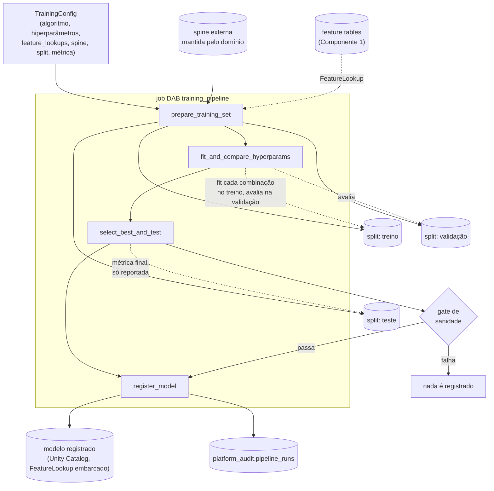

# Design: Componente de Treino

## 1. Contexto

Este é o segundo dos quatro componentes do ecossistema de ML no Databricks. O
Componente 1 — Geração de Features
([`feature-platform`](https://github.com/ViniciusOtoni/feature-platform), spec em
`docs/superpowers/specs/2026-08-23-geracao-de-features-design.md`) já produz feature
tables maduras, versionadas, com gate de qualidade bloqueante e uma tabela de auditoria
central (`platform_audit.pipeline_runs`). Este componente consome essas feature tables
via `FeatureLookup` para treinar modelos.

O pedido original do usuário para este componente: ele define o algoritmo, os
hiperparâmetros a comparar, quais feature tables usar e o dataset de treino (spine) com
seu percentual de split; o componente abstrai o `fit`, a montagem do pipeline, a
validação (comparação entre hiperparametrizações) e o teste.

O design foi produzido via interview em rounds (skill `grilling`), com cada decisão
aprovada explicitamente pelo usuário antes de avançar.

## 2. Escopo

**Dentro do escopo:**
- Contrato de configuração (`TrainingConfig`) cobrindo algoritmo, hiperparâmetros,
  feature lookups, spine, split, métrica e hooks de customização.
- Split temporal (não aleatório) do dataset de treino.
- Comparação de hiperparametrizações via holdout de validação, com teste final
  reportado separadamente.
- Hook para transformações de negócio custom via `TransformerMixin`/`BaseEstimator`.
- Hook para pyfunc de inferência custom via subclasse de `FeaturePlatformModel`.
- Gate de sanidade antes do registro do modelo no Unity Catalog.
- Reuso do schema de auditoria do Componente 1 (`platform_audit.pipeline_runs`), sem
  extensão.

**Fora do escopo (decisão explícita):**
- **Geração da spine.** O dataset de treino (entidade + data de referência + label) é
  produzido e mantido pelo time de domínio fora deste framework. Gerar a spine embute
  regra de negócio (como definir o label, qual a janela de observação) que este
  componente não deve decidir — mesma fronteira que o Componente 1 já estabeleceu para
  features genéricas vs. regra de negócio.
- **Comparação plain-vs-FeatureLookup.** Já provada pela POC original
  (`databricks-feature-lookup-poc`); reproduzi-la em todo treino de produção dobraria o
  custo de cada execução sem gerar informação nova. Este componente sempre loga um
  único modelo, com `FeatureLookup` embarcado.
- **Regressão e multi-classe.** O v1 cobre só classificação binária. Não fecha porta:
  como o pyfunc é totalmente sobrescrevível (seção 6), um caso de regressão pode ser
  resolvido via override mesmo sem suporte de primeira classe.
- **Promoção automática de alias.** Decisão de negócio, não só técnica — fica manual
  (seção 8).
- **Geração automática de grid de hiperparâmetros** (cartesian product). O usuário
  passa uma lista explícita de combinações a testar — uma restrição deliberada dado o
  teto de compute da Databricks Free Edition (serverless, tasks limitadas), que tornaria
  fácil disparar uma explosão combinatória cara sem perceber.

## 3. Arquitetura geral



## 4. Contrato (`TrainingConfig`)

Uma dataclass Python, instanciada pelo usuário em
`dominios/<domínio>/training_configs.py` — mesma convenção de pastas do `feature-platform`.

```python
from dataclasses import dataclass, field
from typing import Callable, Literal
from sklearn.base import TransformerMixin


@dataclass(frozen=True)
class FeatureLookupSpec:
    table_name: str
    feature_names: list[str]
    lookup_key: str
    timestamp_lookup_key: str


@dataclass
class TrainingConfig:
    domain: str
    model_name: str
    algorithm: type                       # classe scikit-learn, ex.: RandomForestClassifier
    hyperparameter_sets: list[dict]       # combinações explícitas — sem grid automático
    feature_lookups: list[FeatureLookupSpec]
    spine_table: str                      # tabela externa, mantida pelo time de domínio
    label_column: str
    reference_date_column: str
    train_pct: float
    val_pct: float
    test_pct: float                       # train_pct + val_pct + test_pct == 1.0
    metric: str | Callable                # scorer compatível com scikit-learn
    metric_direction: Literal["maximize", "minimize"]
    custom_transforms: list[TransformerMixin] = field(default_factory=list)
    pyfunc_model_class: type | None = None  # None = usa FeaturePlatformModel default
```

`FeatureLookupSpec` espelha exatamente os parâmetros nativos de `FeatureLookup` da
Feature Engineering API do Databricks (`table_name`, `feature_names`, `lookup_key`,
`timestamp_lookup_key`) — não é uma abstração nova, é o mesmo contrato que a POC já
validou, só reexposto dentro do `TrainingConfig`.

## 5. Split temporal e comparação de hiperparâmetros

O split nunca é por linha aleatória. O framework:

1. Extrai as datas de referência **distintas** (safras) da spine, ordenadas.
2. Calcula os pontos de corte cronológicos que melhor aproximam `train_pct` /
   `val_pct` / `test_pct` em número de linhas, sem quebrar uma safra ao meio (todas as
   linhas de uma mesma data de referência vão para o mesmo split).
3. Treino = safras mais antigas; validação = safras seguintes; teste = safras mais
   recentes.

Para cada combinação em `hyperparameter_sets` (testadas sequencialmente, sem
paralelização — o job já não paraleliza tasks entre si, ver seção 7): fit no split de
treino, avaliação no split de validação pela `metric`. A combinação escolhida é a que
otimiza `metric` na direção de `metric_direction`. O split de teste **nunca** participa
da escolha — é avaliado uma única vez, ao final, só para reportar a métrica do modelo
selecionado.

## 6. Pipeline e customização

```python
from sklearn.pipeline import Pipeline

pipeline = Pipeline([
    *[(f"custom_{i}", t) for i, t in enumerate(config.custom_transforms)],
    ("model", config.algorithm(**best_hyperparameters)),
])
```

As transformações de negócio do usuário (`TransformerMixin`/`BaseEstimator`) entram
antes do estimador, que o framework garante ser sempre o último step — isso é o que
permite ao wrapper de pyfunc (abaixo) saber de onde extrair a predição, independente de
quantas transformações custom o usuário declarar.

**Pyfunc customizável.** O framework expõe uma classe base:

```python
import mlflow.pyfunc


class FeaturePlatformModel(mlflow.pyfunc.PythonModel):
    """Default: retorna P(classe positiva) como coluna double, igual ao
    ProbabilityScorer validado na POC."""

    def __init__(self, model):
        self.model = model

    def predict(self, context, model_input, params=None):
        return self.model.predict_proba(model_input)[:, 1]
```

O usuário passa `pyfunc_model_class=MeuModeloCustomizado` no `TrainingConfig` apenas
quando precisa de um comportamento diferente do default (ex.: retornar a classe em vez
da probabilidade, ou compor múltiplas saídas). Quando omitido, `FeaturePlatformModel` é
usado como está.

## 7. Job DAB e disparo

Quatro tasks sequenciais — o pipeline de treino é sequencial por natureza (diferente do
Componente 1, onde paralelizar entre feature tables fazia sentido); dividir em tasks
aqui não ganha paralelismo, mas ganha observabilidade por etapa:

| Task | Responsabilidade |
|---|---|
| `prepare_training_set` | Resolve `FeatureLookup`s contra a spine, aplica o split temporal, materializa treino/validação/teste. |
| `fit_and_compare_hyperparams` | Para cada combinação em `hyperparameter_sets`: monta o `Pipeline` (seção 6), treina no split de treino, avalia no split de validação. |
| `select_best_and_test` | Seleciona a melhor combinação por `metric`/`metric_direction`; avalia a métrica final (só reportada) no split de teste; roda o gate de sanidade (seção 8). |
| `register_model` | Loga o modelo (`fe.log_model`, com `FeatureLookup` embarcado) e registra uma nova versão no Unity Catalog. Não move nenhum alias. |

**Sem schedule padrão.** O job é disparado sob demanda
(`databricks bundle run training_pipeline -t dev`) ou via CI — nunca automaticamente
por cron. Isso mantém o humano no controle de quando um modelo novo entra em jogo,
consistente com a promoção de alias manual (seção 8). Retry de qualquer task reinicia a
execução do zero: diferente do Componente 1, não há estado incremental a preservar
entre tentativas.

## 8. Gate de sanidade e registro

Antes de registrar qualquer versão do modelo — mesmo como challenger, sem mover alias
nenhum — o framework bloqueia o registro se:
- a métrica de teste for `NaN` ou infinita;
- o modelo não conseguir gerar predição para nenhuma linha do split de teste.

Isso reaproveita o padrão `Finding` do Componente 1 (`src/quality.py` da POC), adaptado
para checks de modelo em vez de checks de dado. Não é um crivo de qualidade de negócio
— só uma checagem de sanidade técnica, para não poluir o Unity Catalog com versões
degeneradas.

**Nome do modelo registrado** segue a mesma convenção de nomenclatura das feature
tables do Componente 1: `<catalog>.<domain>_models.<model_name>`.

**Promoção de alias `champion`/`challenger` é manual.** Todo treino bem-sucedido
registra uma versão nova; nenhum treino move o alias `champion` sozinho. Um humano
decide a promoção depois de revisar a métrica de teste (via CLI ou UI do Unity
Catalog). Isso é deliberado: qual modelo vai para produção é uma decisão de negócio,
não só uma comparação de métrica agregada — automatizar isso antes de haver histórico
de confiança no processo é arriscado, e fica fácil automatizar depois.

## 9. Auditoria

Reaproveita **exatamente** o schema de `platform_audit.pipeline_runs` já desenhado no
Componente 1, sem estender colunas:

| Coluna | Uso neste componente |
|---|---|
| `component` | `"training"` |
| `entity_name` | nome do modelo registrado |
| `git_commit` / `git_branch` | do deploy que originou a execução |
| `run_id` | Databricks Job Run |
| `mode` | `"train"` |
| `status` | `SUCCESS` / `FAILED` |
| `window_start` / `window_end` | reaproveitados para guardar o range de datas (min/max `reference_date`) da spine usada no treino — não é uma janela de processamento incremental como no Componente 1, mas o mesmo par de colunas descreve bem o range de dados envolvido. |
| `run_ts` | timestamp de início da execução |

Detalhe de experimento (hiperparâmetros testados, métricas por combinação) fica só no
MLflow — um experimento por modelo registrado, correlacionável com a linha de auditoria
pela tag `git_commit` que todo run de treino recebe. O módulo de auditoria
(`RunRecord`, `write_run`, `to_row`) é **duplicado** neste repositório a partir do
`feature-platform`, não importado como dependência — é pequeno o bastante (uma
dataclass e duas funções) para que a duplicação custe menos do que orquestrar uma
dependência cross-repo ou extrair um pacote `platform-core` só para isso agora. Vale
reconsiderar se um terceiro ou quarto componente também precisar dele.

## 10. Testes

Mesmo padrão dos outros componentes: lógica pura (cálculo dos cortes de split a partir
das safras distintas, seleção da melhor combinação de hiperparâmetros dado um dicionário
de métricas, checks do gate de sanidade, construção do `RunRecord`) é testável com
`pytest` local, sem Spark. A execução real (`FeatureLookup`, `fit` de um
`sklearn.Pipeline`, `fe.log_model`, registro no Unity Catalog) é exercitada via notebook
num job Databricks real.

## 11. Riscos e restrições conhecidas (Databricks Free Edition)

Herdados do Componente 1, sem mudança: Jobs serverless-only com máximo de 5 tasks
concorrentes por conta (não relevante aqui, já que as 4 tasks deste job são
sequenciais, não concorrentes); DABs exigem `serverless: true` em todo cluster. Nenhum
risco novo identificado especificamente para o componente de treino.

## 12. Dependência para os próximos componentes

- **Serving** (Componente 3) depende da convenção de nome de modelo
  (`<catalog>.<domain>_models.<model_name>`) e do esquema de alias
  (`champion`/`challenger`) definidos aqui para saber qual versão servir.
- **Monitoramento** (Componente 4) consome a tabela `platform_audit.pipeline_runs`
  (linhas com `component="training"`) para saber quando um modelo foi retreinado, e
  eventualmente vai querer disparar uma nova execução deste job quando sugerir retreino
  — o mecanismo exato desse disparo fica para o design do Componente 4, não deste.
